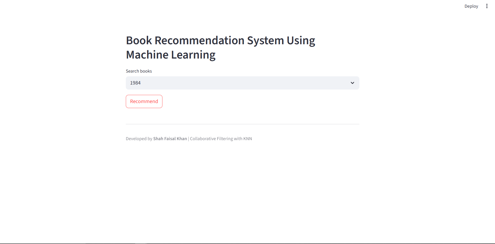
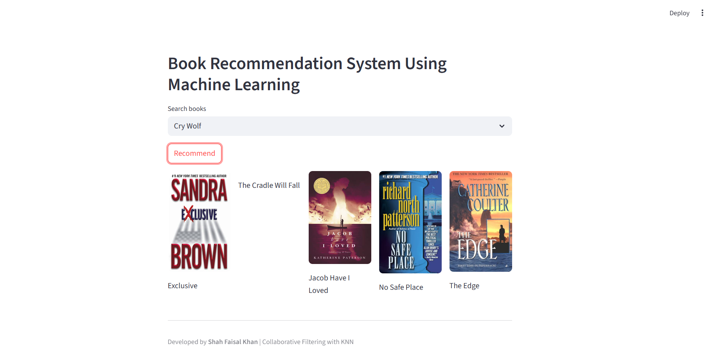

# 📚 Book Recommendation System with Streamlit

An interactive Book Recommendation System built using Collaborative Filtering (KNN) and deployed as a Streamlit Web App.
The app recommends books based on user-selected input, leveraging Books, Users, and Ratings datasets.

## 🚀 Features

- Collaborative Filtering using K-Nearest Neighbors (KNN)
- Interactive Streamlit Web App for recommendations
- Select a book and get similar book suggestions instantly
- Uses three datasets: Books.csv, Users.csv, and Ratings.csv
- Easy to extend to other domains (movies, music, e-commerce)

## 🛠️ Tech Stack

- Python 3.10+
- Streamlit – Web app framework
- Pandas & NumPy – Data cleaning and manipulation
- Scikit-learn – KNN model implementation
- Pickle – Model serialization

## 📂 Datasets

The system uses three datasets:

- Books Dataset – Metadata about books
   - ISBN, Book-Title, Book-Author, Year-Of-Publication, Publisher

- Users Dataset – Information about users
   - User-ID, Location, Age

- Ratings Dataset – Explicit ratings given by users
   - User-ID, ISBN, Book-Rating (0–10 scale)

## 🏗️ Project Structure
```
book-recommendation-system/
│
├── Data/                      # Datasets      
│   ├── BX-Books.csv
│   ├── Bx-Users.csv
│   └── BX-Book-Ratings.csv
│
├── Books/                     # saved model/cleaned dataset/book names         
│   └── book_model.pkl
│   └── book_name.pkl
│   └── book_pivot.pkl
│   └── final_df.pkl
│
│
├── app.py                     # Streamlit web app
├── book_recommendation.ipynb  # Notebook
├── requirements.txt           # Dependencies
└── README.md                  # Project documentation
```

## ⚙️ How It Works

- Data Preprocessing – Merge Books, Users, and Ratings datasets
- User-Item Matrix – Build pivot table (users vs books)
- KNN Algorithm – Find nearest neighbors (similar books)
- Web App – User selects a book → Model generates top recommendations

## ▶️ Installation & Usage

Clone the repository:

`git clone https://github.com/your-username/book-recommendation-system.git
cd book-recommendation-system`


Install dependencies:

`pip install -r requirements.txt`


Run the Streamlit web app:

`streamlit run app.py`

## 📊 Example (App UI)



[Click here to run it on live server](https://book-recommendation-system-using-ml-auxe5gedp49brcnpspnhet.streamlit.app/)


## 🔮 Future Improvements

- Add Content-Based Filtering (genre, author, keywords)
- Hybrid model (Collaborative + Content-based)
- Deploy on Streamlit Cloud / Heroku / AWS
- Add user login system to personalize recommendations

## 👨‍💻 Author

**Shah Faisal Khan**
- 📧 Email: shahfaisal3102@gmail.com
- [LinkedIn](www.linkedin.com/in/shah-faisal-khan-882965235)
